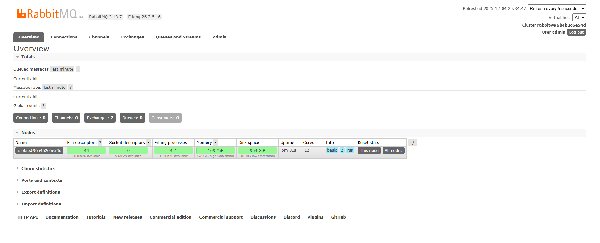
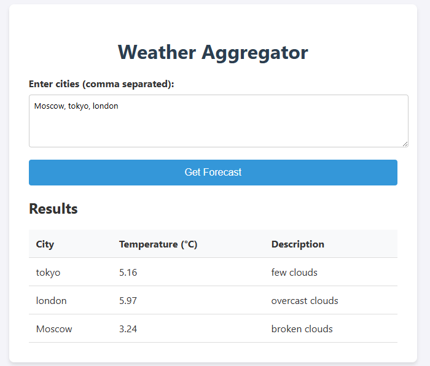

# Система Агрегации Погоды

Распределенная система агрегации прогнозов погоды с использованием Spring Boot и RabbitMQ.
**Выполнил**: Аннануров Даниил Петрович ИВТ 1.2 4 курс

## Установка

1.  **RabbitMQ**: Запустите брокер RabbitMQ.
    ```bash
    docker-compose up -d
    ```
    Доступ к интерфейсу управления по адресу http://localhost:15672 (admin/admin).




## Сборка и Запуск

1.  **Weather API Service** (Порт 8080)
    ```bash
    cd weather-api-service
    mvn spring-boot:run
    ```

2.  **Weather Consumer Service** (Порт 8081)
    ```bash
    cd weather-consumer-service
    mvn spring-boot:run
    ```

3.  **Weather Aggregator Service** (Порт 8082)
    ```bash
    cd weather-aggregator-service
    mvn spring-boot:run
    ```

## Использование

1.  Откройте `weather-frontend/index.html` в вашем браузере.
2.  Введите список городов (например, "London, Paris, New York").
3.  Нажмите "Get Forecast" (Получить прогноз).
4.  Дождитесь появления результатов в таблице.



## Архитектура

- **Frontend**: Отправляет HTTP POST запрос в API Service.
- **API Service**: Разбивает запрос на отдельные сообщения, отправляет их в RabbitMQ (`weather.request.queue`), ожидает агрегированный ответ.
- **Consumer Service**: Слушает `weather.request.queue`, вызывает OpenWeatherMap API, отправляет ответ в `weather.response.queue`.
- **Aggregator Service**: Слушает `weather.response.queue`, агрегирует ответы по Correlation ID, отправляет итоговый отчет в `weather.aggregated.queue`.
- **API Service**: Получает итоговый отчет из `weather.aggregated.queue` и возвращает HTTP ответ.
